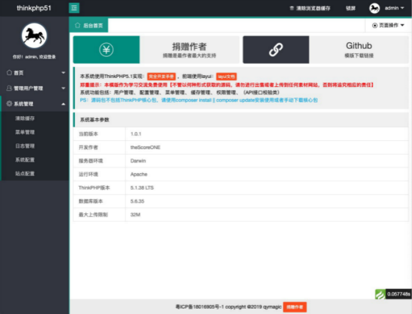

##### 一、开发规范
[开发规范](https://www.kancloud.cn/zhanghongbean/tp51_bbs/1303152)

##### 二、配置信息
* 1、在项目根目录创建 .env，配置环境
```
[APP]
NAME=ThinkBBS
HOST=bbs.test
DEBUG=true
TRACE=true

[DB]
HOST=localhost
NAME=think_bbs
USERNAME=homestead
PASSWORD=secret
PORT=3306
PREFIX=bbs_
```
* 2、框架提供的助手函数 env() 是用来读取环境变量的，所以我们接下来使用该方法把 config/app.php 和 config/database.php 里的配置值改成读取以上配置信息。
项目配置：`config/app.php`
```
<?php
return [
// 应用名称
'app_name'               => env('app.name', 'theScoreONE'),
// 应用地址
'app_host'               => env('app.host', 'http://bbs.test'),
// 应用调试模式
'app_debug'              => env('app.debug', false),
// 应用Trace
'app_trace'              => env('app.trace', false),
.
.
```
* 3、数据库配置：`config/database.php`
```
<?php
return [
// 数据库类型
'type'            => 'mysql',
// 服务器地址
'hostname'        => env('db.host', '127.0.0.1'),
// 数据库名
'database'        => env('db.name', ''),
// 用户名
.
.
```
##### 三、验证器Validate
* 1、验证类的基类：`app\api\validate\BaseValidate` 

* 2、继承基类创建新的验证类：`app\api\validate\IDMustBePositiveInt`

* 3、自定义验证规则
```php
protected function isPositiveInteger($value, $rule='', $data='', $field='')
{
    if (is_numeric($value) && is_int($value + 0) && ($value + 0) > 0) {
        return true;
    }
    return $field . '必须是正整数';
}
```

* 4、独立验证器的使用
```php
$validate = new IDMustBePositiveInt();
$validate->goCheck();
```

##### 四、AOP和全局异常处理

* 1、自定义异常类的基类：`app\common\exception\BaseException`

* 2、重写Handle的render方法，实现自定义异常消息：`app\common\exception\ExceptionHandler`

* 3、修改默认的配置，`config\app.php`配置文件
```php
// 异常处理handle类 留空使用 \think\exception\Handle
'exception_handle'       => '\app\common\exception\ExceptionHandler',
```

* 4、继承`BaseException`异常基类创建新的异常类
```php
/**
 * Class ParameterException
 * 通用参数类异常错误
 */
class ParameterException extends BaseException
{
    public $code = 0;
    public $message = 'invalid parameters';
    public $httpCode = 500;

}
```

* 5、使用自定义异常
```php
// 抛出一个自定义异常
throw new ParameterException('参数中包含有非法的参数名user_id或者uid');
```

#### 五、API版本管理

* 1、控制器`controller`目录下创建版本目录，如`v1`、`v2`...
* 2、路由加上版本信息：如：`Route::get('api/:version/banner', 'api/:version.Banner/getBanner');`

#### 六、微信登录token
* 1、配置`app_id`和`app_secret`和换取用户`openid及session_key`的url地址，查看`\config\wx.php`
* 2、小程序前端调用 `wx.login()` 获取 临时登录凭证`code`
* 3、code上传到服务端调用 `auth.code2Session` 接口，换取 用户唯一标识 `OpenID` 和 会话密钥 `session_key`
* 4、随机数+时间戳+盐 md5加密生成token
    ```php
    // 生成令牌
    public static function generateToken()
    {
        $randChar = getRandChar(32); // 获取32位长度的随机数
        $timestamp = $_SERVER['REQUEST_TIME_FLOAT'];
        $tokenSalt = config('setting.token_salt'); // 配置的盐
        return md5($randChar . $timestamp . $tokenSalt);
    }
    ```
* 5、将token作为key值，微信返回的openid相关作为value存到缓存中，并设置有效期
```php
// 写入缓存
private function saveToCache($wxResult)
{
    $key = self::generateToken();
    $value = json_encode($wxResult);
    $expire_in = config('setting.token_expire_in'); // 有效期配置
    $result = cache($key, $value, $expire_in);

    if (!$result) {
        throw new TokenException('服务器缓存异常', 500);
    }
    return $key;
}
```
* 6、token作为返回值到前端，之前网络请求token值放在header头部带上
* 7、上面获取openid时查询用户表数据是否有该openid的记录，没有则新增一条`User`用户数据

#### 七、路由变量规则和分组
```php
// product
//Route::get('api/:version/product/:id', 'api/:version.Product/getOne'); // 有误
Route::get('api/:version/product/:id', 'api/:version.Product/getOne',[],['id'=>'\d+']);
Route::get('api/:version/product/recent', 'api/:version.Product/getRecent');

// 路由分组
Route::group('api/:version/address',function(){
    Route::get('', 'api/:version.Address/getUserAllAddress');
    Route::post('', 'api/:version.Address/createOrUpdateAddress');
    Route::get('/default', 'api/:version.Address/getUserDefaultAddress');
    Route::delete(':aid', 'api/:version.Address/deleteAddress');
});
```
限定getOne传入id为正整数，否则`api/:version/product/recent`路由调用的也是getOne方法

#### 八、验证码：

* 1、安装think-captcha扩展包

`composer require topthink/think-captcha=2.*`

* 2、配置验证码开启状态：应用配置目录captcha.php文件

`'is_open' => true`

#### 九、用户、权限及权限分配

[查看admin模块源码， 用户、权限组及权限的分配rbac](./用户、权限组及权限的分配rbac.md)

  

#### 参考

1、用户、权限及权限分配 (https://github.com/yuan-dian/originThink)